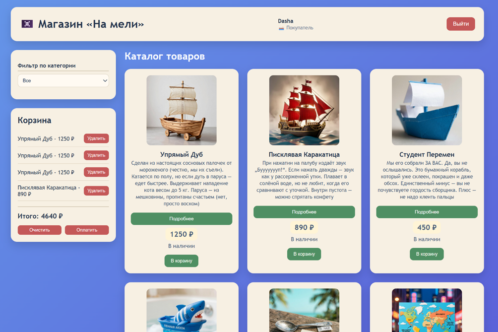
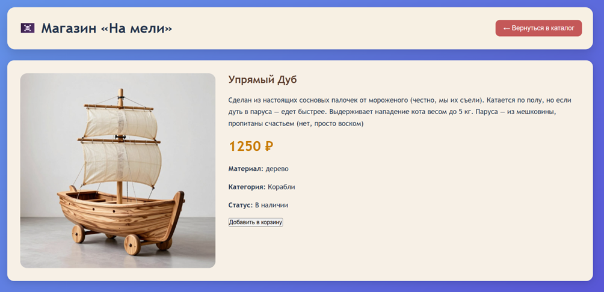
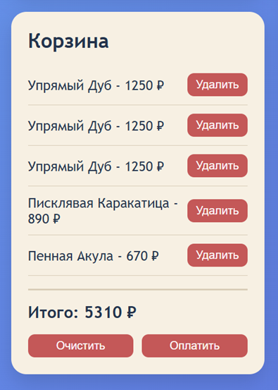
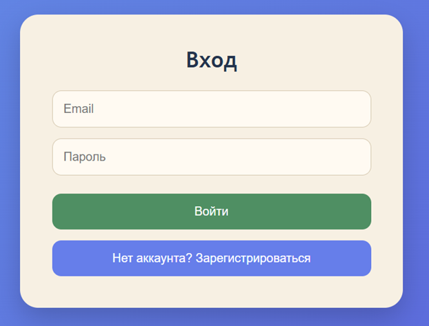
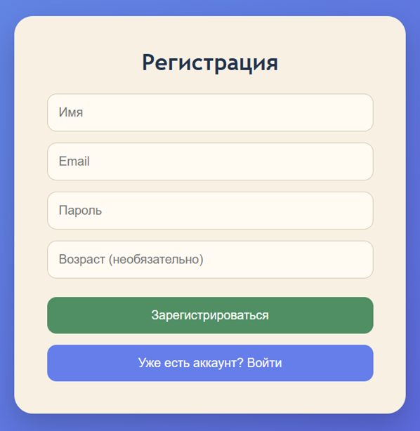
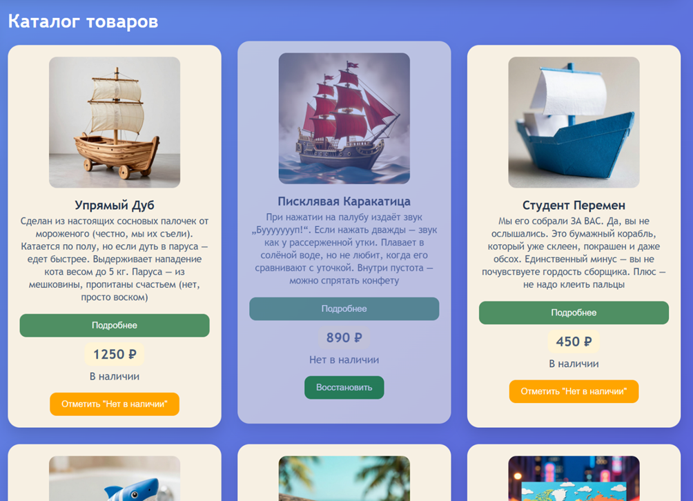
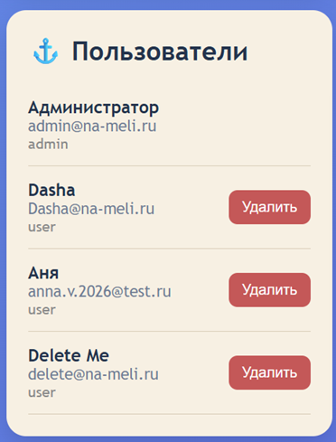

# На мели ⚓


**«На мели»** — клиент-серверное веб-приложение интернет-магазина игрушечных кораблей ⚓.
Проект реализует каталог товаров, фильтрацию, просмотр подробной информации, корзину, регистрацию и авторизацию пользователей, а также отдельную функциональность для администратора.

Проект выполнен в рамках курсовой работы по дисциплине **«Клиент-серверные приложения»** и направлен на практическое применение технологий разработки клиент-серверных веб-приложений.

## Функциональность

### Каталог товаров ⚓

* 🔎 **Просмотр каталога:** отображение доступных игрушечных кораблей с основной информацией о товаре.
* 🏷️ **Фильтрация:** фильтрация товаров по категориям.
* 📦 **Информация о наличии:** отображение текущего статуса товара.
* 🔍 **Карточка товара:** просмотр подробного описания, характеристик, изображения и стоимости.
* 🛒 **Добавление в корзину:** возможность добавить выбранный товар в корзину.

### Корзина 🛒

* ➕ **Добавление товаров:** добавление товаров из каталога.
* ➖ **Удаление товаров:** удаление отдельных позиций из корзины.
* 🗑️ **Очистка корзины:** удаление всех товаров.
* 💰 **Расчёт стоимости:** автоматический подсчёт общей суммы заказа.
* 💾 **Сохранение состояния:** содержимое корзины сохраняется в `LocalStorage` и восстанавливается после перезагрузки страницы.
* ✅ **Оформление заказа:** очистка корзины после завершения оформления.

### Регистрация и авторизация 🔐

* 📝 **Регистрация:** создание нового пользовательского аккаунта.
* ✉️ **Проверка данных:** валидация введённых данных при регистрации.
* 🔑 **Авторизация:** вход зарегистрированного пользователя в систему.
* 👤 **Роли пользователей:** поддерживаются роли пользователя и администратора.
* 🔒 **Хранение паролей:** пароли на серверной стороне сохраняются в виде хешей.

### Панель администратора ⚙️

* 👥 **Просмотр пользователей:** получение списка зарегистрированных пользователей.
* 🗑️ **Удаление пользователей:** возможность удаления пользователей.
* 📦 **Управление товарами:** изменение информации о наличии товаров.
* 🛡️ **Разделение прав:** административные функции доступны в зависимости от роли пользователя.

## Архитектура

Приложение построено по трёхуровневой клиент-серверной архитектуре:

```text
┌─────────────────────────────┐
│         React SPA           │
│     Клиентская часть        │
│                             │
│  Каталог · Корзина · Auth   │
│       · Админ-панель        │
└──────────────┬──────────────┘
               │
          HTTP / JSON
               │
               ▼
┌─────────────────────────────┐
│        PHP REST API         │
│       Серверная часть       │
│                             │
│  Авторизация · Пользователи │
│       · Товары · Логика     │
└──────────────┬──────────────┘
               │
               ▼
┌─────────────────────────────┐
│       JSON-хранилище        │
│                             │
│ users.json · products.json  │
│          app.log            │
└─────────────────────────────┘
```

Клиентская часть отвечает за пользовательский интерфейс и взаимодействие с REST API. Серверная часть реализует бизнес-логику и обработку запросов, а данные хранятся в JSON-файлах.

## REST API

Основное взаимодействие между клиентской и серверной частью осуществляется через REST API.

| Метод    | Endpoint                   | Назначение                     |
| -------- | -------------------------- | ------------------------------ |
| `POST`   | `/api/register`            | Регистрация пользователя       |
| `POST`   | `/api/login`               | Авторизация пользователя       |
| `GET`    | `/api/users`               | Получение списка пользователей |
| `GET`    | `/api/users/{id}`          | Получение пользователя         |
| `DELETE` | `/api/users/{id}`          | Удаление пользователя          |
| `GET`    | `/api/products`            | Получение списка товаров       |
| `PATCH`  | `/api/products/{id}/stock` | Изменение наличия товара       |

## Скриншоты

### Каталог

<div align="center">
    
    <p>Каталог игрушечных кораблей</p>
</div>

### Карточка товара

<div align="center">
    
    <p>Подробная информация о товаре</p>
</div>

### Корзина

<div align="center">
    
    <p>Корзина с выбранными товарами</p>
</div>

### Авторизация

<div align="center">
    
    <p>Панель авторизации пользователя</p>
</div>

### Регистрация

<div align="center">
    
    <p>Панель регистрации пользователя</p>
</div>

### Панель администратора

<div align="center">
    
    <p>Панель управления товарами</p>
</div>

<div align="center">
    
    <p>Панель управления пользователями</p>
</div>

## Структура проекта

```text
na-meli-shop/
│
├── backend/
│   ├── api/
│   │   └── index.php
│   ├── models/
│   │   ├── UserModel.php
│   │   └── LogModel.php
│   ├── controllers/
│   │   └── UserController.php
│   └── data/
│       ├── users.json
│       ├── products.json
│       └── app.log
│
├── frontend/
│   ├── src/
│   │   ├── components/
│   │   ├── App.jsx
│   │   ├── ProductCard.jsx
│   │   ├── Cart.jsx
│   │   ├── AuthForm.jsx
│   │   └── AdminPanel.jsx
│   └── ...
│
└── README.md
```

## Технологии и инструменты


* **Frontend:** React, JavaScript
* **Backend:** PHP
* **API:** REST API
* **Формат обмена данными:** JSON
* **Хранение данных:** JSON-файлы
* **Хранение состояния корзины:** `LocalStorage`
* **Веб-сервер:** Apache
* **Локальная среда:** XAMPP

## Принятые технологические решения

* **Клиент-серверная архитектура:** клиентская и серверная части приложения разделены и взаимодействуют посредством HTTP-запросов и REST API.
* **React SPA:** пользовательский интерфейс реализован как одностраничное приложение с использованием функциональных компонентов и хуков.
* **REST API:** сервер предоставляет отдельные endpoints для регистрации, авторизации, работы с пользователями и товарами.
* **JSON-хранилище:** пользовательские данные и информация о товарах хранятся в JSON-файлах.
* **Сохранение корзины:** содержимое корзины сохраняется в `LocalStorage`, благодаря чему состояние корзины восстанавливается после перезагрузки страницы.
* **Разделение ролей:** функциональность приложения зависит от роли авторизованного пользователя.
* **Логирование:** основные события, связанные с регистрацией, авторизацией и административными действиями, записываются в `app.log`.
* **Защита паролей:** пароли пользователей сохраняются на сервере в виде хешей.

## Запуск проекта

### 1. Backend

Для запуска серверной части необходимы:

* PHP;
* Apache;
* XAMPP.

Разместите папку проекта в директории веб-сервера XAMPP и запустите **Apache**.

### 2. Frontend

Перейдите в директорию клиентской части:

```bash
cd frontend
```

Установите зависимости:

```bash
npm install
```

Запустите приложение:

```bash
npm run dev
```

После запуска откройте адрес, указанный Vite в терминале.

> Конкретная команда запуска зависит от настроек проекта в `package.json`.

## Результат

В результате разработано клиент-серверное веб-приложение интернет-магазина игрушечных кораблей с разделением на клиентскую и серверную части.

Проект объединяет каталог товаров, фильтрацию, подробные карточки, корзину, регистрацию и авторизацию пользователей, ролевую модель и административную панель. Взаимодействие между React-клиентом и PHP-сервером осуществляется через REST API с использованием JSON.

## Автор

**Petrova D.S.**

2026
